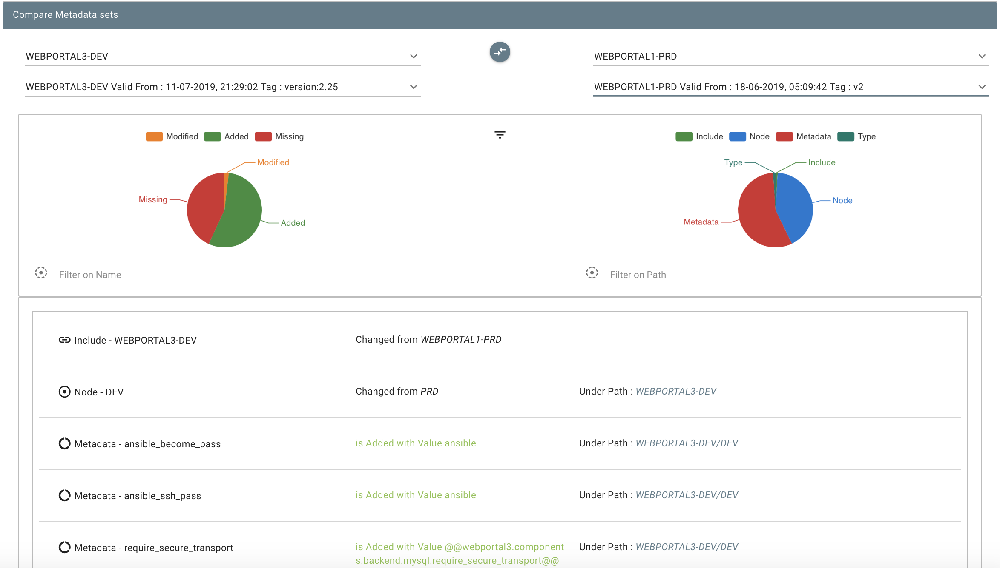

# SWEAGLE

## A quality gate for your configuration data.

SWEAGLE is a Service Now application for managing, consolidating & continuously validating all kinds of configuration data (application, infrastructure, environment, releases) which is crucial to your CI/CD pipeline.  

This extension allows for uploading config data into SWEAGLE so it can be versioned, validated, and made consumable in many different formats.

More info about SWEAGLE can be found at  https://hi.service-now.com/kb_view.do?sysparm_article=KB0853024.

> *Sweagle Overview*

This extension supports the major APIs used to manage your config data lifecycle.

## Upload --> Validate / ValidationStatus --> Snapshot --> Export

- Upload is used to upload a configuration data file in a specific path of Sweagle data model

- Validate is used to validate your configuration versus a specific validation rule

- Validation Status will give you result of all validations rules assigned to your configuration

- Snapshot will create an unalterable release tag for your configuration

- Export is used to export configuration release in any format you need with optional filtering rules also, if required
