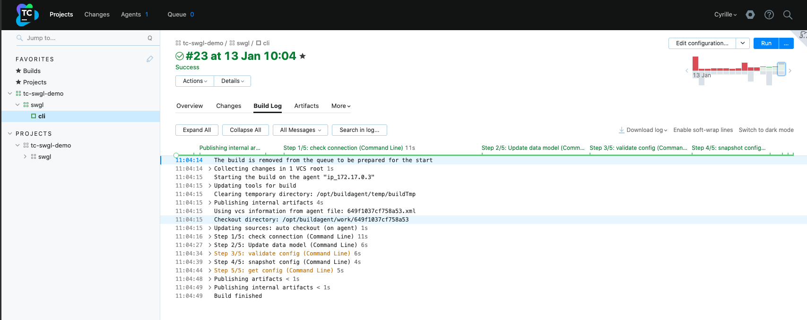

## SWEAGLE INTEGRATION TO TEAMCITY CI/CD

# DESCRIPTION

This folder provides examples of configuration to include SWEAGLE into a TeamCity CI/CD.
SWEAGLE will become the configuration data approval gate after you build your application in DEV and before you deploy it in your Tests and Production environments.

# PRE-REQUISITES
## TeamCity Server

First, run the TeamCity server locally with Docker:
```
docker run -d -it -u 0 --name teamcity-server-instance \
    -v /tmp/teamcity/teamcity_server/datadir:/data/teamcity_server/datadir \
    -v /tmp/teamcity/teamcity_server/logs:/opt/teamcity/logs \
    -p 9111:8111 jetbrains/teamcity-server
```
Configure the server: Open `http://localhost:9111` and proceed through the configuration wizard.

## TeamCity Agent
Second, install a TeamCity agent locally also with Docker:
```
docker run -it -d -u 0 --name teamcity-agent-instance \
    -e SERVER_URL="http://teamcity-server-instance:8111" \
    --link teamcity-server-instance \
    -v /tmp/teamcity/teamcity_agent/conf:/data/teamcity_agent/conf \
    -v /var/run/docker.sock:/var/run/docker.sock  \
    -v /opt/buildagent/work:/opt/buildagent/work \
    -v /opt/buildagent/temp:/opt/buildagent/temp \
    -v /opt/buildagent/tools:/opt/buildagent/tools \
    -v /opt/buildagent/plugins:/opt/buildagent/plugins \
    -v /opt/buildagent/system:/opt/buildagent/system \
    jetbrains/teamcity-agent
```
- Configure the agent by opening a session on the server `http://localhost:9111/login.html`. 
- Click on the **Agent** tab, then **Unauthorized** to check if the agent is successfuly connected. 
- Finally, Click on **Authorize**. The Agent appears in *Connected* tab.

## Sources
- For the server: https://hub.docker.com/r/jetbrains/teamcity-server
- For the agent: https://hub.docker.com/r/jetbrains/teamcity-agent

# CREATE THE PIPELINE

## Create a personal repository in GitHub

Lets create a new repository in your personal github account
- Call it **kotlin**
- make it **Public**
- and add a **Kotlin .gitignore**

Add the file `./tc-swgl-pipeline.kts` to your own **GitHub** repository and commit your change.

In the Kotlin file fill in the accurate values of the keys highlighted by the comment `/* ACTION: enter your ... */`.

## Creating a project from a repository URL

1. From TeamCity server, in **Administration** section, so create a project **From a repository URL** with:
    - Repository URL: your personal *GitHub* repository
    - Fill in your *GitHub* credentials

2. Then the project uploads file and create the project structure from the Kotlin file: `./tc-swgl-pipeline.kts`.

3. The connection is checked and give the project a name and proceed with.

4. The project is created successfully. Lets make the Teamcity changes be in sync with the repository. Navigate to the project settings and **Versioned Settings**.

5. Select **Synchronization enabled**. And set the settings to match your VCS root endpoint previously created. Then click **Apply**.

6. Review the overall settings of the project, sub-project and build configuration.    

That's all !



